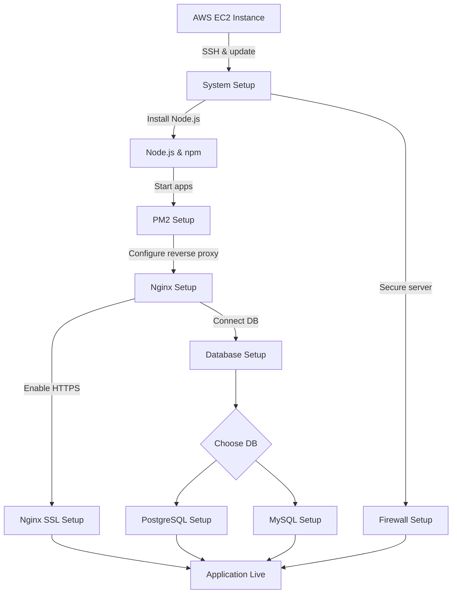

# Deployment Workflow on AWS

This guide combines all individual setup guides into a single workflow, from launching an AWS instance to running your Node.js app behind Nginx with a database and firewall. Use it as a master reference.

---

## 1. Launch AWS Instance

Follow [`aws-instance-setup.md`](01_aws-instance-setup.md) to:

- Launch an Ubuntu EC2 instance.
    
- Connect via SSH.
    
- Update and prepare the system with essential packages.
    

---

## 2. Install Node.js

Follow [`node-installation.md`](02_node-installation.md) to:

- Add NodeSource repository.
    
- Install Node.js LTS and npm.
    
- Install build tools (if required by your packages).
    

---

## 3. Setup PM2

Follow [`pm2-setup.md`](03_pm2-setup.md) to:

- Install PM2 globally.
    
- Start your Node.js app via **direct command** or **ecosystem file**.
    
- Enable PM2 to restart apps automatically on server reboot.
    

---

## 4. Configure Nginx

Follow [`nginx-setup.md`](04_nginx-setup.md) to:

- Install Nginx.
    
- Create a reverse proxy to forward traffic from port 80 to your Node.js app.
    

Optionally, set up HTTPS with [`nginx-ssl-setup.md`](https://chatgpt.com/c/nginx-ssl-setup.md) for secure connections.

---

## 5. Setup Database

Choose your database:

- **PostgreSQL**: [`postgresql-setup.md`](05_postgresql-setup.md)
    
- **MySQL**: [`mysql-setup.md`](05_mysql-setup.md)
    

Create a database, a user, and note the connection string for your app.

---

## 6. Configure Firewall

Follow [`firewall-setup.md`](06_firewall-setup.md) to:

- Allow SSH (for management).
    
- Allow HTTP/HTTPS traffic for Nginx.
    
- Block all other incoming connections for security.
    

---

## 7. Start Your Application

1. Ensure your Node.js app is running under PM2.
    
2. Verify Nginx is correctly proxying requests.
    
3. Check database connectivity from your app.
    

---

## 8. Verify

- Open your domain or server IP in a browser.
    
- Ensure the app is reachable, and HTTPS works if enabled.
    
- Use `pm2 list` and `pm2 logs` to monitor your app.
    
- Test database connection strings from your application.
    

---

Following this workflow sets up a **production-ready AWS instance** with Node.js, PM2, Nginx, a database, and basic firewall security. All individual guides can be referenced for detailed steps.

